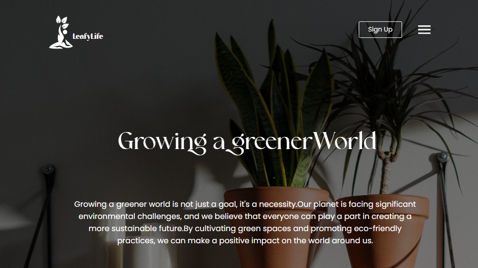

# This is the Plant Website

This is a simple website or webpages that are made for web developement practice purposes. It is not intended for production applications and other websites, it's only a sample website that is intended for Practice of web development.

This is how the home.html will look like!

This website reopsitory is made by Sanidhya P. Jadhao!

## Frameworks Used

There Are several frameworks that are used in this webste development:

### GSAP(GreenSock Animation Platform):
- The first is used GSAP CDN (https://cdnjs.cloudflare.com/ajax/libs/gsap/3.9.1/gsap.min.js)To make simple Javascript animations (Syntax in home.js file).

- The Second is GSAP ScrollTrigger CDN (https://cdnjs.cloudflare.com/ajax/libs/gsap/3.9.1/ScrollTrigger.min.js)To make simple Javascript Scroll Animations (Syntax in home.js file).

#### Thanks For Reading!